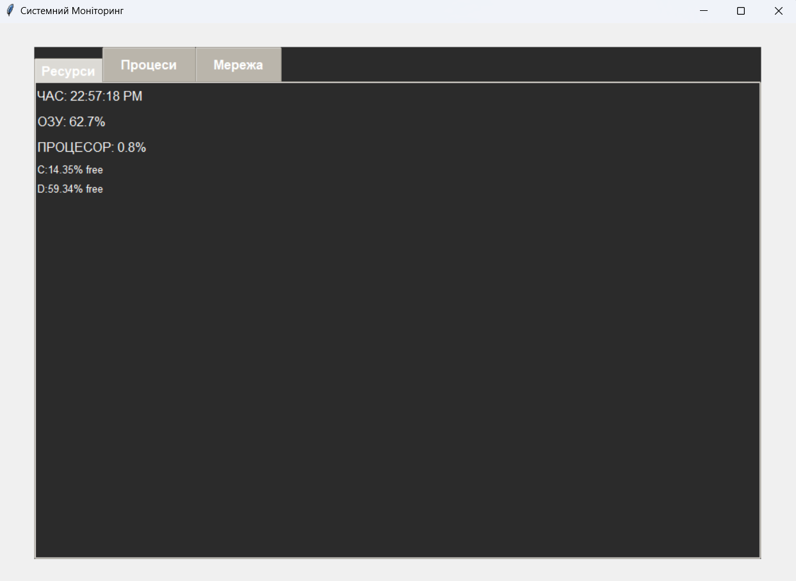

# Monitoring system
### Опис програми
Метою цієї курсової роботи є розробка програми, яка буде мати ті ж функції, що й вбудована програма у Windows. Для того, щоб програма працювала правильно, користувач повинен легко розуміти інтерфейс програми та бути здатним керувати підключенням ПК до бездротової мережі Інтернет. Я використав системну бібліотеку «wlanapi.lib», яка містить готові методи для взаємодії з бездротовим модулем в ПК.
### Вибір мови та середовища програмування
Я вибрав мову програмування Python для написання утиліти, оскільки ця мова є об'єктно-орієнтованою, має динамічну систему типізації і надає широкий вибір інструментів для програміста. Я використовуватиму середовище програмування PyCharm для написання програми, оскільки воно має зручний інтерфейс, широкий набір інструментів для створення графічного інтерфейсу користувача. Крім того, PyCharm дозволяє легко тестувати та налагоджувати програми, що розробляються в ньому.
### Бібліотеки, які використовуються при написанні програми
* Psutil - це бібліотека для мови програмування Python, яка дозволяє отримувати інформацію про процеси, які працюють на комп'ютері, а також про використання системних ресурсів (таких як ЦП, пам'ять, диски, мережа та датчики). Ця бібліотека дозволяє моніторити систему, профілювати та обмежувати ресурси процесів та управляти запущеними процесами. Вона надає багато функціональності, яка доступна в командному рядку UNIX, такі як ps, top, iotop, lsof, netstat, ifconfig, free та інші. Psutil підтримується на різних платформах.
* Tkinter - це графічна бібліотека для створення користувацького інтерфейсу програм на мові програмування Python. Вона використовує засоби бібліотеки Tk, яка є відкритою і поширюється разом з вихідним кодом. Tkinter є частиною стандартної бібліотеки Python, тому вона доступна на різних платформах. 
### Опис інтерфейсу програми
*	Resource monitoring
* Processes
*	Networks

Програма відображає актуальні дані про стан системи, такі як поточний час, відсоток використання оперативної пам'яті та центрального процесора. Це дозволяє користувачу моніторити поточний стан системи та вчасно реагувати на потенційні проблеми з її продуктивністю.
